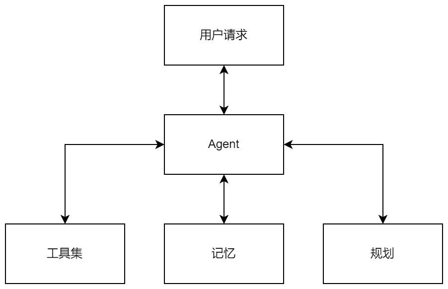
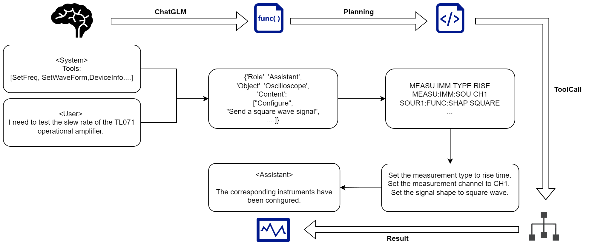
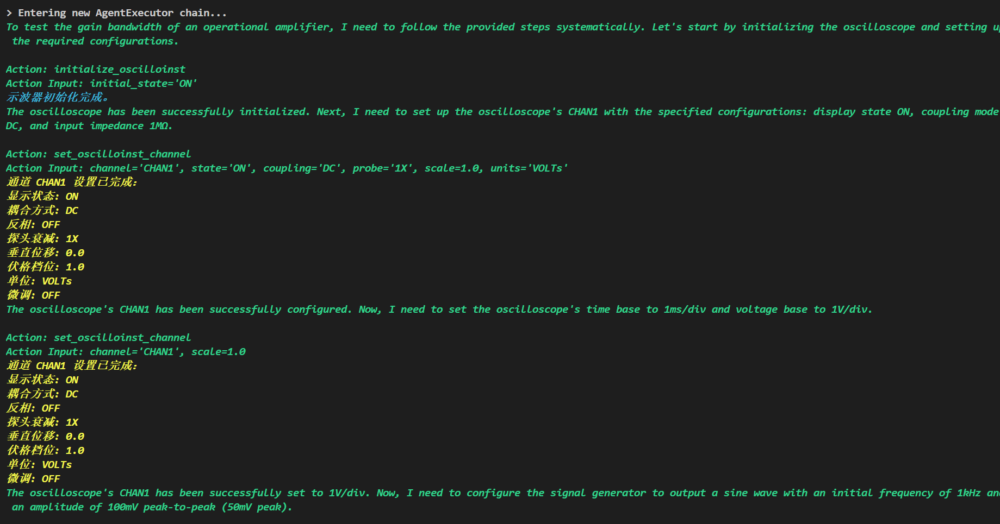

<h1 align="center">InstruAgent</h1>

<p align="center">
  _🎯 一个简单的Agent，旨在帮助电子工程师进行仪器仪表的自动测试 🎯_
</p>

# 🔈声明

## ⚠安全警告

**本项目 Agent 运行时允许 AI 自由执行任意工具，存在未知风险，请保证上位机是隔离容器环境。**

**同时，Agent 输出的不正确指令流也可能对您的仪器仪表造成未知损害，请详细阅读您的仪器编程手册。**

**项目开发时间截止为 2024 年 6 月 ，技术可能已经过时，请根据您的项目需求修改项目。**

**请知悉并自行承担风险，作者不对使用本项目造成的任何损失负责！**

## 📚项目相关

- 2024年英特尔杯大学生电子设计竞赛  全国一等奖
- 第十九届挑战杯“揭榜挂帅”专项赛 全国特等奖

项目代码并非参赛完整代码，部分代码为 Agent 模块实现。

# ⚙️项目概述

本项目通过集成 LLM-Agent 系统，获取用户请求同时将工具集传入 LLM-Agent，再通过规划模块决策整个调试过程，工具利用后输出标准命令流实现现实仪器的操作以及获取测试的结果，同时在整个系统中都通过记忆模块来储存 Agent 和用户之间的所有交互。

## 💿核心组件

- **用户请求**：通过语音或文本方式输入自然语言需求。

- **Agent **：基于大语言模型（LLM）进行解析和处理。**（支持兼容 类OpenAI 的 RESTful API）**

- **规划模块**：分解任务为子目标，使用 ReAct 提示词策略完成规划。

  ```
  Thought: ...（每一步操控仪器的步骤）
  Action: ...（工具函数调用）
  Observation: ...（仪器输出的结果）
  ......
  AgentFinish: ...（明确任务结束，防止无限循环）
  ```

- **记忆模块**：存储用户输入、Agent控制、仪器输出等上下文信息。
- **工具模块**：通过 Function Calling 调用工具 API 实现仪器操作。



## ▶️工作流程

1. 用户通过语音识别输入请求。
2. LLM-Agent 解析请求并调用工具模块生成操作指令。
3. 工具模块执行指令与仪器交互，并返回结果。
4. 记忆模块存储任务日志，用于优化后续任务执行。
5. 系统输出仪器操作结果与分析报告。



# 🎁快速开始

## 💡环境配置

1. 克隆本项目：

    ```shell
    git clone https://github.com/fullstack-sake/InstruAgent.git
    ```

2. 安装项目依赖

  ```shell
  pip install -r requirements.txt
  ```

3. 配置环境变量

    按照您的 LLM 的 API 配置好`.env`文件，本项目**支持兼容 类OpenAI 的 RESTful API**（你可以本地部署OneAPI或GPT next等项目来发行API，也可直接使用LLM提供商发行的API）

    ```
    API_BASE=
    API_KEY=
    API_MODEL=
    ```

## ✅示例运行

4. 运行主文件

	```shell
	python chains.py
	```

	💫如需测试自定义需求，请修改`chains.py`内 `input` 对应的值：

	```python
	......
	    response1 = total_chain.invoke({"input": "帮我测试一下这个运算放大器的压摆率"})
	    print(str(response1))
	......
	```

5. 运行结果

> 你可能会看到如下图所示的命令行输出：
>
> 
>
> 
>直到 `FinishChain` 结束整个链

# ☎️联系我

欢迎技术交流，如对本项目有问题或建议，请通过 [Issues](https://github.com/fullstack-sake/InstruAgent/issues) 提交。